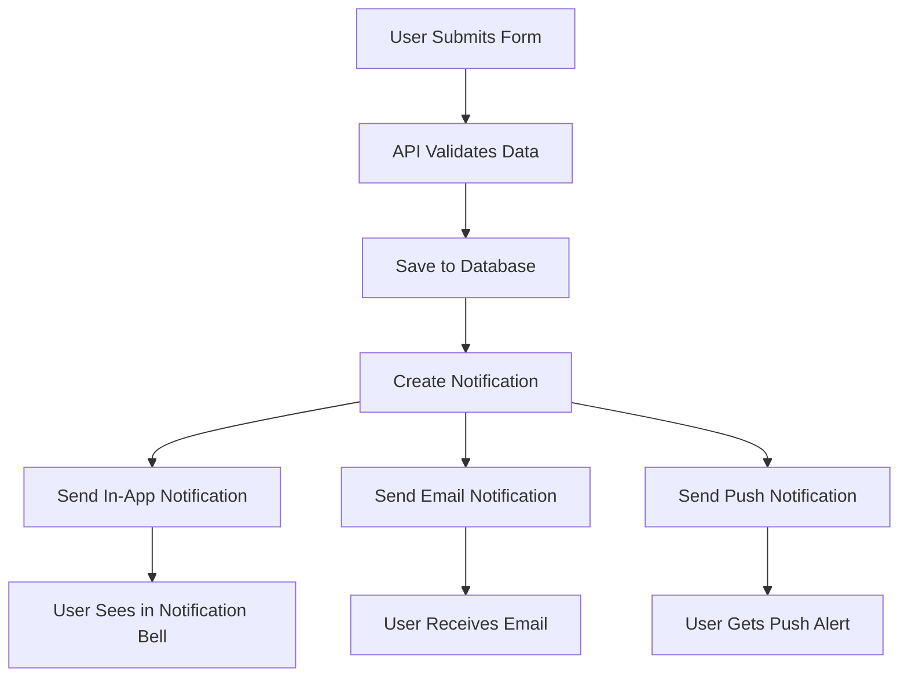

# Interested Form Notification System Guide

This guide explains how the interested form notification system works using the unified notification pattern (same as likes and follows).

## Overview

The interested form now uses the same unified notification system as likes and follows, providing:
- **In-app notifications** (notification bell)
- **Email notifications** (automatic)
- **Push notifications** (browser/mobile)
- **User preference respect** (can disable per notification type)

## How It Works

1. **Form Submission**: User fills out the interested form in `InterestedModal.tsx`
2. **API Processing**: Form data is sent to `/api/interested-form` endpoint
3. **Data Validation**: The system validates the form data and checks startup ownership
4. **Database Storage**: Form data is saved to Sanity as an `interestedSubmission` document
5. **Unified Notification**: A notification is created using `createInterestedSubmissionNotification()`
6. **Multi-channel Delivery**: The system automatically sends:
   - In-app notification (appears in notification bell)
   - Email notification (if user has emails enabled)
   - Push notification (if user has push notifications enabled)

## Notification Flow



## Code Structure

### 1. Notification Creation
```typescript
// In sanity/lib/notifications.ts
export async function createInterestedSubmissionNotification(
  interestedUserId: string,
  startupOwnerId: string,
  startupId: string,
  startupTitle: string,
  interestedUserName: string,
  interestedUserEmail: string,
  interestedSubmissionId: string,
  message: string,
  interestedUserImage?: string,
  additionalData?: { /* form fields */ }
): Promise<string>
```

### 2. API Integration
```typescript
// In app/api/interested-form/route.ts
await createInterestedSubmissionNotification(
  userId, // interested user
  startup.author._id, // startup owner
  startupId,
  startupTitle,
  name, // interested user name
  email, // interested user email
  result._id, // interested submission ID
  message,
  session.user.image, // interested user image
  { /* additional form data */ }
);
```

### 3. Push Notification
```typescript
await ServerPushNotificationService.sendNotification({
  type: 'interested',
  recipientId: startup.author._id,
  title: 'New Interest in Your Startup',
  message: `${name} submitted interest in your startup "${startupTitle}"`,
  metadata: { /* relevant data */ }
});
```

## Notification Types

The system supports these notification types:
- `interested_submission` - New interested form submission
- `like` - Startup liked
- `follow` - User followed
- `comment` - Comment added
- `reply` - Reply to comment

## User Preferences

Users can control notifications in their account settings:
- **Enable/disable all notifications**
- **Control specific types**: like, follow, comment, interested_submission, etc.
- **Email preferences**: Enable/disable email notifications per type
- **Push preferences**: Enable/disable push notifications per type

## Email Content

The email includes all form data:
- **Contact Information**: Name, email, phone, company, role
- **Investment Details**: Amount, type, timeline (if provided)
- **Message**: The interested person's message
- **Additional Links**: LinkedIn, website (if provided)
- **Professional HTML Template**: Responsive design

## Testing

### Test Email Configuration
```bash
curl http://localhost:3000/api/test-email
```

### Test General Email
```bash
curl -X POST http://localhost:3000/api/debug-send-email \
  -H "Content-Type: application/json" \
  -d '{"to": "test@example.com"}'
```

### Test Form Submission
Submit the interested form through the UI and check:
1. **Database**: Notification appears in Sanity
2. **In-app**: Notification appears in notification bell
3. **Email**: Startup owner receives email
4. **Push**: Browser push notification (if enabled)

## Files Involved

- **Form Component**: `components/InterestedModal.tsx`
- **API Endpoint**: `app/api/interested-form/route.ts`
- **Notification Creation**: `sanity/lib/notifications.ts` - `createInterestedSubmissionNotification()`
- **Email System**: `lib/emailNotifications.ts` - `sendCriticalNotificationEmail()`
- **Push System**: `lib/serverPushNotifications.ts` - `ServerPushNotificationService`
- **Database Schema**: `sanity/schemaTypes/interestedSubmission.ts`, `sanity/schemaTypes/notification.ts`

## Benefits of Unified System

1. **Consistency**: Same pattern as likes/follows
2. **Reliability**: Centralized notification handling
3. **User Control**: Unified preference management
4. **Multi-channel**: Automatic in-app, email, and push delivery
5. **Error Handling**: Graceful fallbacks if one channel fails
6. **Scalability**: Easy to add new notification types

## Troubleshooting

### Notification Not Appearing
1. Check if notification was created in Sanity
2. Verify user preferences are enabled
3. Check browser console for errors
4. Verify startup owner is different from interested user

### Email Not Sending
1. Check SMTP configuration (`SMTP_USER`, `SMTP_PASS`)
2. Verify user has email notifications enabled
3. Check server logs for email errors
4. Test email configuration with `/api/test-email`

### Push Notifications Not Working
1. Check if user has granted push permission
2. Verify push notification service is configured
3. Check browser console for push errors
4. Test with other notification types (like, follow)

## Environment Variables

Required for email notifications:
```bash
SMTP_HOST=smtp.gmail.com
SMTP_PORT=587
SMTP_USER=your-email@gmail.com
SMTP_PASS=your-app-password
```

Required for push notifications:
```bash
NEXT_PUBLIC_VAPID_PUBLIC_KEY=your-vapid-public-key
VAPID_PRIVATE_KEY=your-vapid-private-key
VAPID_EMAIL=your-email@example.com
```
